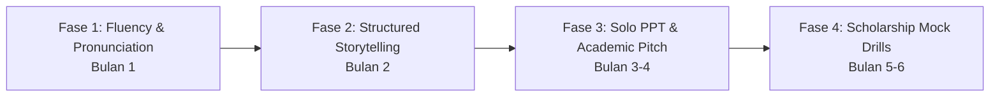

# 🚀 ROADMAP INTENSIF SPEAKING: STUDY ABROAD & SCHOLARSHIP MASTER
> **Target:** Lancar, terstruktur, percaya diri, dan lolos tahap wawancara beasiswa (LPDP, Chevening, AAS, Fulbright, Erasmus, dsb.) serta siap presentasi kuliah di luar negeri.  
> **Fokus Utama:** 100% Speaking Active Output (Storytelling, Solo PPT Presentations, Academic Pitching, & Interview Drills).

---

## 🧭 MENGAPA BANYAK ORANG GAGAL DI SPEAKING BEASISWA?
1. **Rambling (Bicara ngalor-ngidul tanpa struktur):** Interviewer beasiswa punya waktu terbatas. Mereka mencari pemikiran yang terstruktur, bukan sekadar kosakata rumit.
2. **Mental Translation Lag:** Masih mikir bahasa Indonesia di kepala baru diterjemahkan kata per kata.
3. **Kurang "Story Muscle":** Tidak terbiasa menceritakan pengalaman pribadi (kegagalan, kepemimpinan, visi masa depan) dengan emosi dan dampak nyata.

---

## 📅 TIMELINE ROADMAP: 6 BULAN (4 FASE)



---

### 🔹 FASE 1: MENCAIRKAN LIDAH & MEMATIKAN TRANSLATE INDONESIA (Bulan 1)
> **Goal:** Bicara 3-5 menit tanpa macet parah (pauses), pelafalan jelas (clarity), dan membentuk kebiasaan berpikir dalam bahasa Inggris (*Thinking in English*).

#### 1. Rutinitas Harian (30-45 Menit/Hari):
- **Shadowing Technique (15 Menit):**
  - Pilih video pendek TED-Ed, 6-Minute English BBC, atau Vox.
  - Dengarkan 1 kalimat, tirukan intonasi, ritme, jeda, dan *chunking*-nya secara simultan.
  - **Fokus:** Melatih otot mulut agar terbiasa dengan artikulasi suara bahasa Inggris (th, r/l, v/f, past tense -ed endings).
- **Daily 3-Minute Voice Memo (15 Menit):**
  - Nyalakan *voice recorder* HP.
  - Ceritakan hari ini, opini tentang satu berita, atau apa yang kamu makan — **tanpa pause, tanpa buka kamus**.
  - Dengarkan kembali: Catat kata apa yang membuatmu *stuck* (vocab gap). Cari padanannya setelah rekaman selesai.
- **Thought-Chunking & Discourse Markers:**
  - Latih penggunaan frase penghubung alami:
    - *To be honest...*
    - *What I find fascinating is...*
    - *The main takeaway here is...*
    - *In other words...*

#### 🎯 Milestone Akhir Bulan 1:
Mampu merekam monolog 3 menit penuh tentang topik sehari-hari dengan minimal *filler words* ("umm", "err") dan tidak ada hening lebih dari 3 detik.

---

### 🔹 FASE 2: THE ART OF STORYTELLING (Bulan 2)
> **Goal:** Menguasai seni menceritakan pengalaman pribadi dengan teknik wawancara beasiswa standar internasional (**STAR-L Method**).

#### 1. Framework Utama: STAR-L Method
Gunakan formula ini untuk menceritakan semua pengalaman organisasi, kerja, dan riset:
* **S (Situation):** Latar belakang masalah (singkat, 15-20 detik).
* **T (Task):** Tanggung jawab atau tantangan spesifik yang kamu hadapi (15 detik).
* **A (Action):** Langkah konkret yang **kamu** ambil (gunakan *"I"*, bukan *"We"*) (45-60 detik).
* **R (Result):** Hasil terukur/dampak dari aksi tersebut (30 detik).
* **L (Learning):** Pelajaran kepemimpinan/hidup yang kamu dapatkan dan relevansinya untuk studi ke depan (30 detik).

#### 2. Latihan Storytelling Mingguan (Solo):
Setiap minggu, buat 2 rekaman cerita (durasi 2-3 menit) berdasarkan pilar wawancara beasiswa:
- **Minggu 1:** *The Spark* (Alasan memilih jurusan dan bidang studi yang diminati).
- **Minggu 2:** *The Setback / Failure* (Kegagalan terbesar dan cara bangkit kembali).
- **Minggu 3:** *Leadership Under Pressure* (Saat memimpin tim yang bermasalah atau menyelesaikan konflik).
- **Minggu 4:** *Social Impact / Contribution* (Pengalaman memberi dampak pada komunitas/lingkungan sekitar).

#### 3. Metodologi Latihan "3-Stage Drill":
1. **Take 1 (Spontaneous):** Rekam cerita tanpa catatan.
2. **Review & Refine:** Dengarkan rekamannya. Cek: Apakah STAR-L nya jelas? Di mana alur yang berbelit?
3. **Take 2 (Polished):** Rekam ulang dengan intonasi yang lebih meyakinkan dan kata kerja aksi (*implemented, spearheaded, negotiated, optimized*).

---

### 🔹 FASE 3: SOLO PPT PRESENTATIONS & ACADEMIC SPEAKING (Bulan 3 - 4)
> **Goal:** Terbiasa memaparkan ide akademis, riset, atau opini kritis menggunakan slide presentasi secara solo, layaknya mahasiswa di kelas internasional.

#### 1. Format Presentasi PPT Solo: "The 3-Slide Ignite Drill"
Buat 3-5 slide sederhana di PowerPoint atau Canva (cukup gambar/poin kunci, jangan buat tulisan panjang).

* **Slide 1: The Hook & The Problem**
  - Membuka dengan data/fakta mengejutkan.
  - Frase kunci: *"Have you ever wondered why...?", "Today, I want to shed light on a critical issue:..."*
* **Slide 2: The Core Analysis / Proposed Solution**
  - Menjelaskan ide atau pendekatanmu.
  - Frase kunci: *"The root cause lies in three main factors...", "If we examine this from an economic perspective..."*
* **Slide 3: The Conclusion & The Call to Action**
  - Rekomendasi masa depan.
  - Frase kunci: *"Moving forward, this study is crucial because...", "In conclusion, bridging this gap requires..."*

#### 2. Framework Argumentasi: PREP
Setiap kali menjelaskan satu argumen dalam presentasi:
- **P (Point):** *"I strongly believe that renewable energy adoption should be subsidized."*
- **R (Reason):** *"Because the initial capital expenditure remains too high for rural communities."*
- **E (Example):** *"For instance, in rural Kalimantan, micro-hydro systems flourished only after local grants were provided."*
- **P (Point Restated):** *"Therefore, financial incentives are the catalyst for sustainable adoption."*

#### 3. Topik Presentasi PPT Rekomendasi (Pilih 1 per minggu):
1. **My Prospective Master’s/PhD Thesis Topic** (Mengapa topik ini penting dan bagaimana rencana risetmu).
2. **Current Global / National Issue** (contoh: Climate Change, Educational Gap, AI in Healthcare).
3. **Why Country X / University Y is the Perfect Fit for Me** (Analisis program kurikulum, profesor, lab).
4. **My 5-10 Year Vision Post-Study** (Rencana kontribusi konkret setelah lulus).

#### 4. Cara Evaluasi Solo PPT:
- Rekam layarmu dan webcam menggunakan OBS, Zoom (New Meeting -> Record), atau HP di depan laptop.
- Perhatikan: **Eye contact** ke kamera (bukan membaca teks slide), **gestur tangan**, dan **tempo bicara** (tidak terburu-buru).

---

### 🔹 FASE 4: SCHOLARSHIP INTERVIEW MOCK & HIGH-STAKES DEFENSE (Bulan 5 - 6)
> **Goal:** Siap menghadapi pertanyaan jebakan, pertanyaan spontan (*impromptu*), dan wawancara panel beasiswa dengan percaya diri.

#### 1. The "Big 8" Scholarship Questions (Wajib Dikuasai Luar Kepala):
1. *"Tell me about yourself and why you deserve this scholarship."* (Elevator Pitch 90 detik)
2. *"Why did you choose this specific university and country instead of staying in Indonesia?"*
3. *"What is the most significant problem in your field, and how will your study solve it?"*
4. *"Can you describe a situation where you had a disagreement with your supervisor/team?"*
5. *"What will you do if you do not get this scholarship this year?"*
6. *"How will your post-study return directly benefit your home country?"*
7. *"Explain your proposed research/study plan in simple terms to a non-expert."*
8. *"What is your biggest weakness, and what steps are you taking to address it?"*

#### 2. Teknik "Buying Time" (Berpikir Tanpa Panik):
Ketika ditanya pertanyaan sulit, jangan langsung panik atau diam mematung. Gunakan teknik stalling yang elegan:
- *"That is a profound question. Let me break my response down into two key aspects..."*
- *"If we look at this from a policy standpoint, there are a couple of angles to consider..."*
- *"That's an interesting perspective. Based on my prior experience in the field, I would argue that..."*

#### 3. Solo Random Impromptu Drill (The 60-Second Challenge):
- Tulis 30 topik/pertanyaan di kertas atau gunakan generator topik acak.
- Ambil 1 secara acak, berikan waktu persiapan **15 detik**, lalu langsung berbicara selama **60-90 detik** tanpa henti menggunakan struktur PREP.

---

## 🛠️ TOOLKIT & RESOURCE LATIHAN MANDIRI (SOLO LEARNER)

| Kategori | Alat / Aplikasi | Cara Penggunaan |
| :--- | :--- | :--- |
| **Perekam & Review** | Voice Memos / WhatsApp Private Chat | Rekam harian untuk cek perkembangan mingguan |
| **Speech-to-Text & Transkripsi** | Otter.ai / Whisper / Google Docs Voice Typing | Lihat apakah pelafalanmu dimengerti oleh sistem AI |
| **Simulasi Presentasi** | Zoom / Loom / OBS Studio | Rekam diri saat presentasi PPT (Slide + Facecam) |
| **Pengecekan Grammar Suara** | ChatGPT Voice Mode / Claude | Ajak ngobrol simulasi wawancara beasiswa secara lisan |
| **Model Intonasi & Diksi** | TED Talks, Oxford Union, Bloomberg Originals | Amati cara pembicara membedah topik kompleks dengan santai |

---

## 📋 DAILY PROGRESS TRACKER TEMPLATE

Gunakan ceklis ini setiap hari:

```markdown
- [ ] 10 Menit: Shadowing 1 video pendek (Intonasi & Artikulasi)
- [ ] 15 Menit: Latihan 1 Prompt (Storytelling STAR-L atau PREP Argument)
- [ ] 10 Menit: Rekam & Putar ulang (Evaluasi filler words & kejelasan pesan)
- [ ] 5 Menit: Tambahkan 3 frase baru/discourse markers ke 'Speaking Vault' pribadi
```

---
*Roadmap ini dirancang agar kamu tidak hanya lolos ujian tes bahasa (IELTS/TOEFL Speaking Band 7.5+), tetapi benar-benar percaya diri memimpin diskusi di kampus luar negeri dan meyakinkan reviewer beasiswa.*
